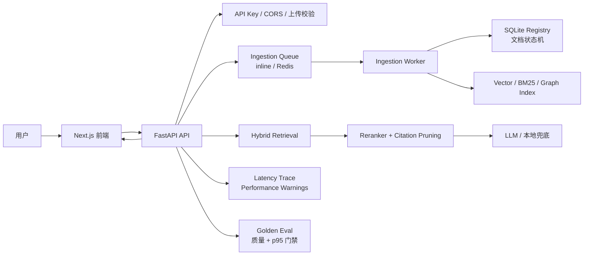

# 项目展示说明

这个项目可以按“完整 RAG 工程闭环”来展示：文档上传后异步入库，经过切片、混合检索、图谱增强、重排、引用裁剪、回答生成、Trace 分段耗时和 Golden Eval 门禁，最后在前端展示可追溯的答案、引用、质量评分和队列状态。

## 架构一图



## 稳定演示流程

1. 启动本地环境：

```powershell
.\scripts\start-dev.ps1
```

2. 打开前端 `http://127.0.0.1:3000`，进入知识库面板。
3. 上传一个 `.txt`、`.md`、`.pdf` 或 `.docx` 文档，观察文档从 `queued / processing` 进入 `ready / partial`。
4. 查看知识库顶部总览、队列健康、DLQ 摘要、文档 attempt 和失败原因。
5. 在对话面板选择“自动”或“知识库”模式提问。
6. 展示回答引用、引用片段、Trace 事件、图谱路径和 performance warnings。
7. 运行 Golden Eval，说明项目不是只靠主观观察，而是有质量和性能门禁：

```powershell
.\scripts\rag-golden-eval.cmd
```

固定演示材料已经放在 [demo/README.md](demo/README.md)。建议面试时直接上传 `demo/docs/` 下的 3 个文档，然后按 [demo/questions.md](demo/questions.md) 提问，并用 [demo/expected.md](demo/expected.md) 对照引用和 Trace。

演示前可以先跑一次轻量自检：

```powershell
.\scripts\demo-pack-smoke.ps1
```

## Latest Verified Flow

Last checked: 2026-05-25 19:47 Asia/Shanghai.

- Demo Pack smoke: passed with `.\scripts\demo-pack-smoke.ps1 -KeepDocuments`.
- Demo documents uploaded: 3/3.
- Demo questions checked: 3/3 (`food-returns`, `bot-handoff`, `incident-dependency`).
- Citations returned: yes, 1 citation per checked question.
- Trace returned: yes, 9 trace steps per checked question.
- Report path: `.e2e-data/demo-pack-smoke-report.json`.
- Compose config: `docker compose config --quiet` passed.
- Docker runtime startup: passed on latest commit `b8dc9a0` with `docker compose up --build -d`; API, web, Redis, Elasticsearch, Milvus, MinIO, Neo4j, and ingestion worker started, with exposed API health returning `{"status":"ok","version":"0.1.0"}` and web returning HTTP 200.
- GitHub Actions status: success confirmed on GitHub for latest commit `b8dc9a0`, with Backend tests, Frontend checks, and Docker Compose config all green.
- Security hygiene: previously exposed API key has been rotated; keep `.env` local and do not display real keys during demos.

## 面试讲法

- 不是简单套壳调用 LLM：项目覆盖了文档入库、检索、重排、引用、评估、Trace 和运营状态。
- 可解释性是主线：答案必须带引用，Trace 能看到检索、重排、引用裁剪、评估和分段耗时。
- 可靠性有闭环：异步入库有状态机、失败重试、DLQ、手动 retry 和 cancel。
- 质量可回归：Golden Eval 同时检查 Recall、MRR、Citation Precision、Refusal Accuracy、Behavior Pass、p95 和 performance warnings。
- 本地可演示、生产可迁移：本地支持 inline/auto 降级，生产可切 Redis worker，Docker Compose 已包含相关服务。

## 面试前验收

面试当天建议先按 [docs/interview-day-checklist.md](docs/interview-day-checklist.md) 检查 Docker Desktop、`.env`、demo 文档、固定问题和最新 GitHub Actions。

快速收口检查：

```powershell
.\scripts\check.cmd -SkipGoldenEval
```

完整验收检查：

```powershell
.\scripts\check.cmd
```

单独端到端冒烟：

```powershell
powershell.exe -NoProfile -ExecutionPolicy Bypass -File .\scripts\e2e-smoke.ps1
```

## 项目历程

1. 基础 RAG：完成 FastAPI + Next.js 的上传、切片、检索和问答。
2. 检索质量：加入混合检索、Reranker、引用裁剪和弱相关拒答。
3. 可解释性：补齐 Trace、图谱路径、引用片段和质量评分展示。
4. 性能治理：加入 retrieval health 缓存、Latency Trace、性能预算和 warning。
5. 质量门禁：用 Golden Eval 自动检查质量指标、p95 和 performance warnings。
6. 生产化入库：从同步/后台任务升级到文档状态机、Redis worker、重试、取消、DLQ 和队列健康。
7. 收口展示：把能力收束到知识库总览、演示文档和一键验收脚本，方便面试讲清楚。
