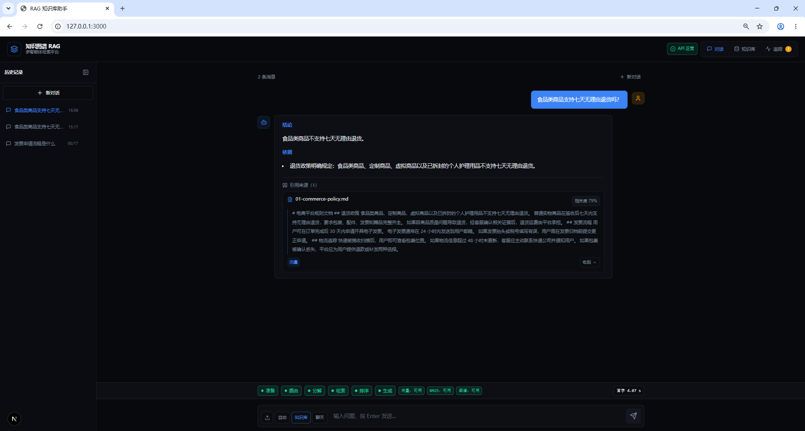
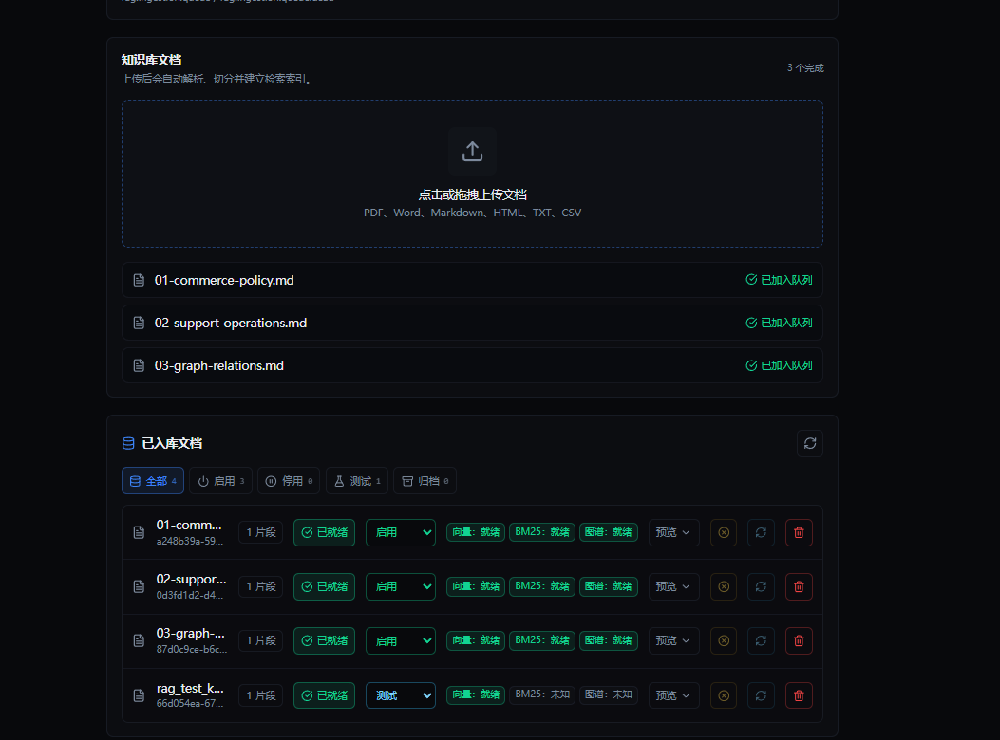

# 知识图谱 RAG 平台

这是一个面向工程化展示的本地 RAG 平台：后端使用 FastAPI，前端使用 Next.js，默认带 SQLite 向量检索兜底，并可接入 Milvus、Elasticsearch、Neo4j、MinIO 和 Redis。项目重点不是“套壳聊天”，而是把 RAG 做成可解释、可评估、可运营的完整闭环。

## 30 秒读懂

- **完整 RAG 链路**：文档上传、异步入库、切片、混合检索、重排、引用裁剪、回答生成和质量评估。
- **可解释回答**：每次回答都带引用来源，Trace 面板展示检索、重排、引用、生成、评估和分段耗时。
- **Graph RAG 增强**：支持实体关系抽取、图谱检索和多跳路径证据展示。
- **生产化入库**：文档状态机、Redis worker、失败重试、取消入库、DLQ 和队列健康面板。
- **质量与性能门禁**：Golden Eval 自动检查 Recall、MRR、Citation Precision、Refusal Accuracy、Behavior Pass、p95 latency 和 performance warnings。
- **稳定演示材料**：内置 Demo Pack、标准问题、预期答案、2 分钟讲稿和一键 demo smoke。



## 技术栈

| 层级 | 技术 |
| --- | --- |
| Frontend | Next.js, TypeScript, Tailwind CSS |
| Backend | FastAPI, Pydantic, SQLite registry |
| Retrieval | SQLite vector fallback, BM25, reranker, citation pruning |
| Graph | Neo4j, entity/relation extraction, graph-path evidence |
| Ingestion | inline/auto fallback, Redis queue, worker, retry, DLQ |
| Quality | deterministic evaluator, Golden Eval, latency trace budgets |
| Ops | Docker Compose, API Key auth, CORS allowlist, upload validation |

## 快速验证

```powershell
.\scripts\check.cmd -SkipGoldenEval
.\scripts\rag-golden-eval.cmd
```

如果本地后端已经启动，可以先跑 Demo Pack 自检：

```powershell
.\scripts\demo-pack-smoke.ps1
```

## 演示与架构

面试或作品集展示时，建议先看 [DEMO.md](DEMO.md)。里面包含架构图、稳定演示流程、项目历程、面试讲法和完整验收命令。

固定演示材料在 [demo/README.md](demo/README.md)，包含可上传文档、标准问题、预期答案和 2 分钟讲稿。



生产化边界和上线前检查见 [docs/production-notes.md](docs/production-notes.md)。

面试当天的启动顺序、环境检查和常见翻车点见 [docs/interview-day-checklist.md](docs/interview-day-checklist.md)。

## 本地开发

在仓库根目录运行：

```powershell
.\scripts\start-dev.ps1
.\scripts\smoke-test.ps1
```

开发脚本会启动：

- 前端页面：`http://127.0.0.1:3000`
- 后端接口：`http://127.0.0.1:8001`

推荐的稳定演示流程：

1. 在对话面板或知识库面板上传支持格式的文档。
2. 等待文档状态从“排队中/入库中”变为“已就绪”或“部分就绪”。
3. 使用“自动”或“知识库”模式提问。
4. 查看回答、引用来源和检索追踪。

支持上传的文件扩展名包括 `.pdf`、`.docx`、`.txt`、`.md`、`.markdown`、`.html`、`.htm` 和 `.csv`。默认单文件上传限制是 10 MB，可通过 `MAX_UPLOAD_BYTES` 调整。

文档上传采用异步入库：`POST /api/documents/upload` 会先返回 `queued` 状态和 `job_id`，后台再完成解析、切片、向量/BM25/图谱索引。前端会自动轮询文档状态；脚本或外部调用方可以查询 `GET /api/documents/{document_id}/status`，等待状态进入 `ready`、`partial` 或 `duplicate` 后再发起知识库问答。

生产环境建议使用 Redis 持久队列承接入库任务：`INGESTION_QUEUE_MODE=redis` 时，API 只负责保存上传文件和写入队列，`python -m app.ingestion.worker` 独立消费任务并支持失败重试。Docker Compose 已包含 `ingestion-worker` 服务；本地开发默认 `auto`，Redis 不可用时会自动降级为进程内后台任务。正在 `queued/processing` 的文档可通过 `POST /api/documents/{document_id}/cancel` 取消入库；失败达到最大重试次数后会进入 DLQ，可通过 `GET /api/documents/ingestion/health` 查看队列健康，通过 `GET /api/documents/ingestion/dead-letter` 查看失败任务摘要，通过 `POST /api/documents/{document_id}/retry` 手动重试。

每次完成回答后，系统都会运行确定性的 RAG 质量评估，并把结果保存到 SQLite。评分维度包括事实支撑度、回答相关性、引用覆盖率和检索质量。可以通过 `POST /api/kb/evaluate` 直接评分，也可以通过 `GET /api/kb/evaluations` 查看最近保存的评分结果。

## 验证方式

运行项目收口自检：

```powershell
.\scripts\check.cmd
```

如果只想快速检查代码和构建，可以跳过 Golden Eval：

```powershell
.\scripts\check.cmd -SkipGoldenEval
```

运行后端契约测试：

```powershell
.\scripts\test-backend.ps1
```

运行前端生产构建：

```powershell
cd frontend
npm.cmd run build
```

运行完整本地端到端冒烟测试：

```powershell
.\scripts\e2e-smoke.ps1
```

端到端冒烟测试会在隔离端口启动临时后端和前端，上传测试文档，验证文档列表和片段预览，发起一次有依据的知识库问答，检查引用和 Trace 事件，然后删除测试文档并停止临时服务。如果希望测试后保留临时服务，可以加 `-KeepServices`。

运行真实浏览器 UI 端到端测试：

```powershell
.\scripts\ui-e2e.ps1
```

UI 端到端测试会启动隔离服务，并用 Playwright 驱动真实 Chrome：通过页面上传文档，检查知识库面板，发起有依据的问题，验证可见引用，并确认 Trace 面板包含检索记录和质量分。

如果 PowerShell 阻止本地脚本，可以临时放行本次执行：

```powershell
powershell.exe -NoProfile -ExecutionPolicy Bypass -File .\scripts\start-dev.ps1
```

运行 Graph RAG 对照测试：

```powershell
.\scripts\graph-rag-compare.ps1
```

这个脚本会启动隔离后端，上传一组受控的跨文档关系数据，提出关系推理问题，解析引用、Trace 和质量评分，然后对比向量/BM25 命中与图谱命中。如果 Neo4j 可用，脚本会写入一个小型测试图谱，让这次运行能明确展示图谱检索贡献。需要强制要求图谱检索参与时，可以加 `-RequireGraph`。

运行 Graph RAG 多跳问题测试集：

```powershell
.\scripts\graph-multihop-suite.ps1
```

这个脚本要求 Neo4j 可用，会在上传文档后依靠实体关系抽取闭环自动入图，不再手工 seed 图谱。它覆盖“公司 -> 所有者 -> 总部”、“产品 -> 团队 -> 负责人”和“故障 -> 服务 -> 依赖数据库”三类多跳问题，并把报告写入 `.e2e-data/graph-multihop-suite-report.json`。

运行 RAG 评测集对照测试：

```powershell
.\scripts\rag-eval-suite.ps1
```

默认模式会强制关闭真实 LLM 调用，主要验证检索、Reranker、引用裁剪、拒答和本地质量评分链路。要跑真实 LLM 闭环评测，先在 `.env` 或当前终端环境中配置 `OPENAI_API_KEY`、`OPENAI_MODEL` 和可选的 `LLM_BASE_URL`，然后执行：

```powershell
.\scripts\rag-eval-suite.ps1 -UseRealLlm
```

这个脚本会在隔离端口分别运行关闭 Reranker 和开启 Reranker 的后端，上传同一组受控文档和干扰文档，统计 Top1 命中文档、引用命中文档和回答质量分，并把报告写入 `.e2e-data/rag-eval-suite-report.json`。

运行可长期维护的 Golden Set 评测：

```powershell
.\scripts\rag-golden-eval.cmd
```

Golden Set 存放在 `eval/golden-rag-cases.json`，包含固定文档、标准问题、期望证据文档、期望关键词和负样本。脚本会统计 `Recall@K`、`MRR`、`Citation Precision`、`Refusal Accuracy`、`Behavior Pass`、`Latency p50/p95` 和 Trace 性能告警，并生成 `.e2e-data/rag-golden-eval-report.json` 与 `.e2e-data/rag-golden-eval-report.md`。默认门禁要求 `Recall@K=100%`、`Citation Precision>=95%`、`Refusal Accuracy=100%`、`Behavior Pass=100%`、`Latency p95<=8000ms` 且 `performance_warnings=0`；任一失败都会让脚本以非零状态退出。需要临时观察但不因性能告警失败时，可以加 `-AllowPerformanceWarnings`。要跑真实 LLM 闭环评测：

```powershell
.\scripts\rag-golden-eval.cmd -UseRealLlm
```

## 环境配置

本地开发可以不创建 `.env` 文件，因为后端已经为本地端口和 SQLite 兜底存储提供默认值。Docker 或类生产环境运行前，建议从模板创建真实 `.env`：

```powershell
Copy-Item .env.example .env
notepad .env
```

部署前请替换所有 `replace-me` 占位值。最重要的配置项：

- `OPENAI_API_KEY`、`OPENAI_MODEL`、`EMBEDDING_MODEL` 和 `LLM_BASE_URL`：用于回答生成和向量化。
- `NEXT_PUBLIC_API_URL`：浏览器访问后端时使用的公开地址。
- `API_AUTH_TOKEN` 和 `NEXT_PUBLIC_API_AUTH_TOKEN`：启用业务 API 的 Bearer Token 校验；两个值需要保持一致。未配置 `API_AUTH_TOKEN` 时，本地开发会跳过鉴权。
- `CORS_ORIGINS`：允许访问后端的前端来源。
- `NEO4J_PASSWORD`、`MINIO_ACCESS_KEY` 和 `MINIO_SECRET_KEY`：Docker 服务的凭据。
- `MAX_UPLOAD_BYTES`、`CHUNK_SIZE`、`CHUNK_OVERLAP`、`TOP_K` 和 `RERANK_TOP_K`：控制文档入库和检索行为。
- `RERANKER_ENABLED`、`RERANKER_ORIGINAL_WEIGHT`、`RERANKER_QUERY_WEIGHT`、`RERANKER_PHRASE_WEIGHT` 和 `RERANKER_SOURCE_WEIGHT`：控制本地轻量重排序层，用问题覆盖、短语命中、融合分和多源信号把直接证据排到前面。
- `CITATION_MAX_ITEMS`、`CITATION_PER_DOCUMENT_LIMIT`、`CITATION_MIN_RELATIVE_SCORE` 和 `CITATION_MIN_QUERY_COVERAGE`：控制最终展示给用户的引用裁剪，避免弱相关片段混入回答。
- `GRAPH_ENTITY_EXTRACTION_ENABLED`、`GRAPH_ENTITY_EXTRACTION_SYNC` 和 `GRAPH_ENTITY_EXTRACTION_TIMEOUT_SECONDS`：控制文档上传后的实体关系抽取闭环。没有 LLM Key 时会使用本地规则抽取，方便离线验证 Graph RAG 多跳链路。
- `RETRIEVAL_HEALTH_CACHE_SECONDS`：缓存 ES/Neo4j 可用性探测结果，避免每次查询重复 TCP 探测；本地默认 10 秒。
- `TRACE_STEP_BUDGETS_MS`：配置 Trace 阶段性能预算，例如 `backend_health=500,retrieve=300,rank=100,cite=50,evaluate=100`；超预算阶段会写入 `performance_warnings` 并在 Trace 面板标黄。
- `INGESTION_QUEUE_MODE`、`INGESTION_QUEUE_NAME`、`INGESTION_DLQ_NAME`、`INGESTION_QUEUE_DIR`、`INGESTION_MAX_ATTEMPTS` 和 `INGESTION_RETRY_DELAY_SECONDS`：控制异步入库队列、失败队列、上传文件暂存目录和失败重试策略；生产建议使用 `redis` 模式。

运行本地环境检查：

```powershell
.\scripts\env-check.ps1
```

运行更严格的类生产环境检查，要求 `.env` 存在并拒绝占位值：

```powershell
.\scripts\env-check.ps1 -RequireEnv -Production
```

如果开发服务已经启动，还可以同时检查后端健康、前端页面和编译后的 CSS：

```powershell
.\scripts\env-check.ps1 -CheckServices
```

## 生产部署检查清单

公开部署前请确认：

- 轮换所有泄露过或本地使用过的 API Key。
- 复制 `.env.example` 为 `.env`，并替换所有 `replace-me`。
- 设置 `DEBUG=false`。
- 将 `NEXT_PUBLIC_API_URL` 设置为公开后端地址。
- 将 `CORS_ORIGINS` 限定为公开前端来源。
- 设置 `API_AUTH_TOKEN`，并让前端构建使用相同的 `NEXT_PUBLIC_API_AUTH_TOKEN`。
- 为 `NEO4J_PASSWORD`、`MINIO_ACCESS_KEY` 和 `MINIO_SECRET_KEY` 设置强密码。
- 运行 `.\scripts\deploy-check.ps1`。
- 执行 `docker compose up --build` 后，再跑一次完整容器冒烟测试。

## Docker 运行

```powershell
docker compose up --build
```

默认的 Compose 配置偏向生产运行：构建镜像时不把本地源码目录挂载进容器，要求从 `.env` 读取密钥，容器带重启策略，并为 `api` 和 `web` 暴露健康检查。

生产主机推荐流程：

```powershell
Copy-Item .env.example .env
notepad .env
.\scripts\deploy-check.ps1
docker compose up --build -d
docker compose ps
```

容器健康后，验证这些地址：

- 前端页面：`http://localhost:3000`
- 后端健康检查：`http://localhost:8000/api/health`
- API 文档：`http://localhost:8000/api/docs`

后端镜像默认不安装 `sentence-transformers`。推荐使用 OpenAI 兼容的向量模型，例如 `text-embedding-3-small`；如果必须在容器内使用本地 Transformer 向量模型，可以把 `sentence-transformers` 加回 `backend/requirements.txt`。
